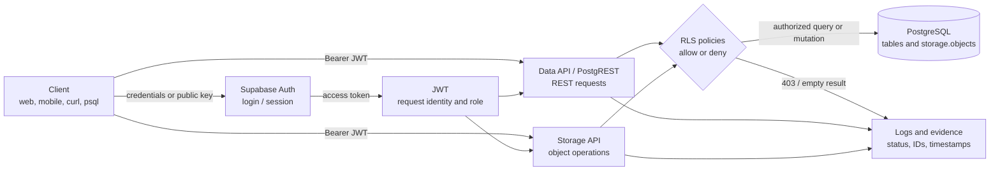

# Supabase support architecture

This is a simplified support-troubleshooting view of the request path. Exact behavior depends on the client, endpoint, policies, and project configuration.

## How to use the diagram during triage

- Login failure: start at the client/Auth boundary; do not begin with PostgreSQL RLS.
- Empty Data API response: compare database rows with the request JWT role and the applicable table policy.
- Storage 403: inspect bucket operation, object path, session role, and `storage.objects` policy.
- REST 404: verify route/resource resolution before changing authorization policies.
- `psql` authentication failure: inspect endpoint, username, database, TLS, and password stage separately from Data API Auth.
